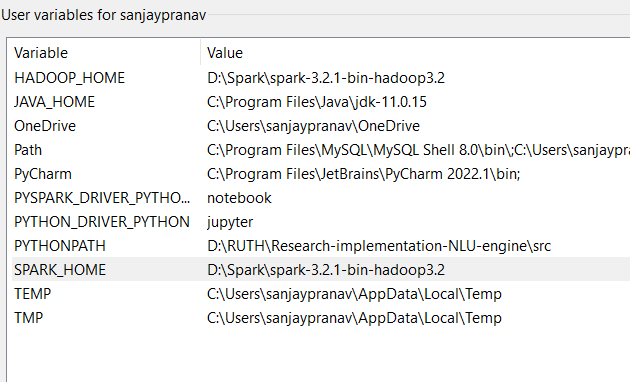
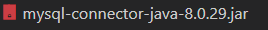
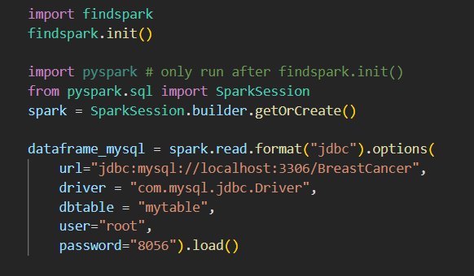

# Pyspark-BreastCancer-Spamham

# Introduction about Pyspark 
Apache Spark is a lightning fast real-time processing framework. It does in-memory computations to analyze data in real-time. It came into picture as Apache Hadoop MapReduce was performing batch processing only and lacked a real-time processing feature. Hence, Apache Spark was introduced as it can perform stream processing in real-time and can also take care of batch processing.

Apart from real-time and batch processing, Apache Spark supports interactive queries and iterative algorithms also. Apache Spark has its own cluster manager, where it can host its application. It leverages Apache Hadoop for both storage and processing. It uses HDFS (Hadoop Distributed File system) for storage and it can run Spark applications on YARN as well.

## Dataset 

Here I used Kaggle Dataset For Breast cancer prediction and data is in SQL format.

## Description of the dataset

About Dataset
Features are computed from a digitized image of a fine needle aspirate (FNA) of a breast mass. They describe characteristics of the cell nuclei present in the image.
n the 3-dimensional space is that described in: [K. P. Bennett and O. L. Mangasarian: "Robust Linear Programming Discrimination of Two Linearly Inseparable Sets", Optimization Methods and Software 1, 1992, 23-34].

This database is also available through the UW CS ftp server:
ftp ftp.cs.wisc.edu
cd math-prog/cpo-dataset/machine-learn/WDBC/

Also can be found on UCI Machine Learning Repository: https://archive.ics.uci.edu/ml/datasets/Breast+Cancer+Wisconsin+%28Diagnostic%29

Attribute Information:

1) ID number
2) Diagnosis (M = malignant, B = benign)
3-32)

Ten real-valued features are computed for each cell nucleus:

a) radius (mean of distances from center to points on the perimeter)
b) texture (standard deviation of gray-scale values)
c) perimeter
d) area
e) smoothness (local variation in radius lengths)
f) compactness (perimeter^2 / area - 1.0)
g) concavity (severity of concave portions of the contour)
h) concave points (number of concave portions of the contour)
i) symmetry
j) fractal dimension ("coastline approximation" - 1)

The mean, standard error and "worst" or largest (mean of the three
largest values) of these features were computed for each image,
resulting in 30 features. For instance, field 3 is Mean Radius, field
13 is Radius SE, field 23 is Worst Radius.

All feature values are recoded with four significant digits.

Missing attribute values: none

Class distribution: 357 benign, 212 malignant

    !Note need java version should be 8 to 11

you can check your version by running below command

    java -version

## Setting up spark with pip environment and conda 

## Step 1: Creating Spark environment 

### Pip environment

In cmd/terminal/gitbash/powershell

    pip install virtualenv
    mkdrir Spark
    cd Spark

for windows users creating environment:

    python -m venv Spark

To activate 
    
        cd Spark
        source Scripts/activate

    

for linux users to create and activate venv

    virtualenv Spark
    cd Spark
    source bin/activate

### Conda environment

    conda create -n Spark python>=3.8
    conda activate Spark

## Step 2: Installing pyspark

    pip install pyspark
    pip install -r requirements.txt

## Step 3 Install Spark-hadoop:

Download latest version of Spark-hadoop from https://spark.apache.org/downloads.html 

for additional info  https://spark-packages.org/

## Step 4 : add winutils file and system environment paths 

thats all you all set..... :)

## Now lets go for sql-connect part 

For this you need .jar file of mysql connector and mysql driver to be pasted on downloaded spark hadoop file 

then here driver code for my sql connet 

For further information please go through pyspark documentation to proceed classification and regression tasks.
